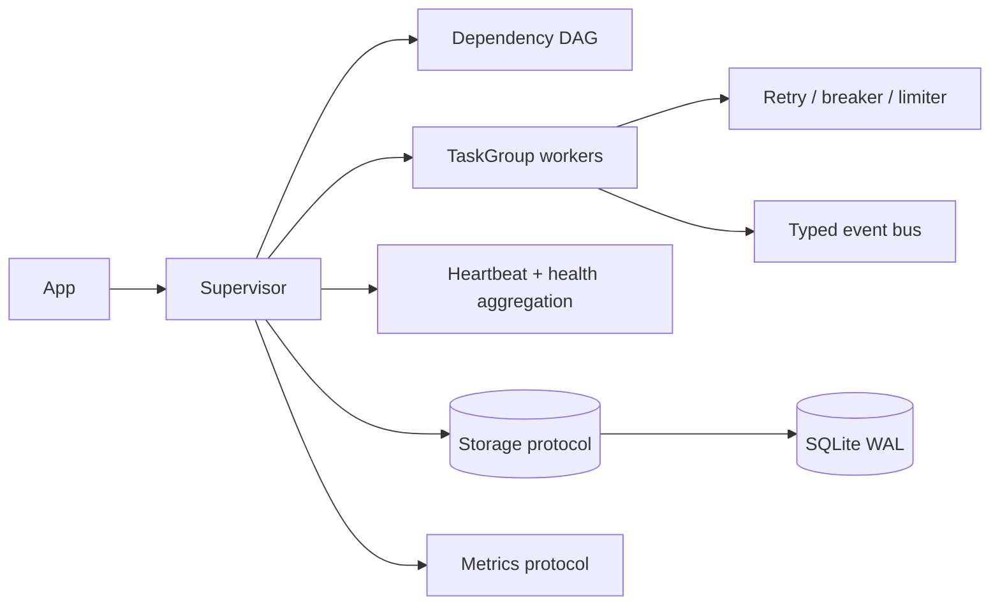

# runtime-sentinel

[](https://github.com/NAOKI-Ko/runtime-sentinel/actions/workflows/ci.yml)


[](LICENSE)

`runtime-sentinel` is a lightweight runtime supervisor for asyncio applications, workers,
and jobs. It combines lifecycle supervision, dependency-aware scheduling, health monitoring,
resilience policies, persistence, and observability without imposing an application framework.

## Why this exists

Long-running asyncio services often rebuild the same fragile loop around task creation,
heartbeats, retry delays, shutdown, and recovery. This library makes those policies explicit,
typed, testable, and replaceable while retaining Python's structured-concurrency model.

## Features

- `asyncio.TaskGroup` supervision with bounded concurrency and graceful cancellation
- immutable lifecycle snapshots and an explicit worker state machine
- heartbeat timeout detection and aggregate health probes
- bounded exponential retry with jitter and failure propagation
- circuit breaker, token bucket, fault-injection hook, and async resource pool
- dependency DAG validation, deterministic topological sort, layers, and priority ordering
- typed fan-out event bus and structured logging fields
- pluggable persistence protocol with a WAL-enabled SQLite adapter
- metrics port with a deterministic in-memory implementation
- JSON status CLI and restart-time snapshot recovery

## Architecture



The domain owns lifecycle rules; orchestration depends only on ports for persistence and
metrics. See [docs/architecture.md](docs/architecture.md) for data flow, concurrency and
trade-offs.

## Installation

```bash
python -m pip install runtime-sentinel
```

For a source checkout:

```bash
python -m pip install '.[dev]'
```

## Quick start

```python
import asyncio
from runtime_sentinel import (
    Health, HealthStatus, SQLiteStorage, Supervisor,
    WorkerContext, WorkerId, WorkerSpec,
)

class Poller:
    async def run(self, context: WorkerContext) -> None:
        while not context.stopping:
            await context.heartbeat()
            await asyncio.sleep(0.2)

    async def health(self) -> Health:
        return Health(HealthStatus.HEALTHY)

async def main() -> None:
    supervisor = Supervisor(SQLiteStorage("sentinel.db"))
    supervisor.register(WorkerSpec(WorkerId("poller"), Poller()))
    async with supervisor:
        await asyncio.sleep(2)

asyncio.run(main())
```

Inspect the recovered state with `runtime-sentinel status sentinel.db`.

## Examples

All examples are executable from the repository root:

```bash
python examples/basic.py
python examples/failure_retry.py
python examples/advanced_concurrency.py
```

They demonstrate normal supervision, observable retry, and dependency-aware bounded
parallelism respectively.

## Design decisions

- Snapshots are frozen dataclasses, so lifecycle changes are auditable value replacements.
- A failed prerequisite propagates failure instead of allowing unsafe downstream work.
- The event bus applies backpressure per subscriber; it does not silently discard events.
- SQLite calls run through `asyncio.to_thread`, keeping the loop responsive without forcing an
  external database dependency.
- Policy interfaces are deliberately narrow to keep adapters easy to implement.

## Testing

The suite contains unit, SQLite integration, concurrency, timeout, failure-injection,
edge-case, and Hypothesis property tests.

```bash
ruff check src tests examples benchmarks
mypy src/runtime_sentinel
pytest
```

Coverage is branch-aware and the configured quality gate fails below 90%.

## Benchmark

The benchmark measures deterministic DAG planning. It reports results from the local machine;
this README intentionally publishes no invented or non-reproducible numbers.

```bash
python benchmarks/benchmark_graph.py --nodes 10000 --rounds 20
```

## Roadmap

- OpenTelemetry metrics and tracing adapter
- Redis-backed distributed leases
- durable event replay and configurable compaction
- pluggable distributed coordination backends

## Contributing

Read [CONTRIBUTING.md](CONTRIBUTING.md) before opening a pull request. Security reports follow
the private process in [SECURITY.md](SECURITY.md).

## License

MIT. See [LICENSE](LICENSE).
