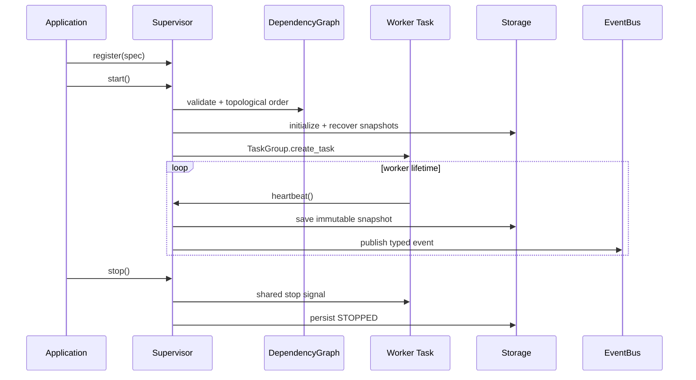

# Architecture

## System overview

Runtime Sentinel supervises user-supplied async workers. Registration builds a dependency DAG;
startup validates it, recovers persisted identities, and launches one task per worker plus a
health monitor inside an `asyncio.TaskGroup`.

## Component responsibilities

- `models`: immutable identities, health values, retry configuration and valid transitions.
- `graph`: deterministic priority-aware topological planning and cycle/unknown-node detection.
- `supervisor`: structured concurrency, dependencies, retries, health and shutdown.
- `events`: bounded fan-out queues with subscriber backpressure.
- `storage`: durable snapshot/event ports and the SQLite WAL adapter.
- `resilience`: independently usable circuit breaker and token bucket.
- `pool`: lazily-created bounded asynchronous resources.
- `metrics`: telemetry-neutral counter and timing port.

## Data flow

Worker actions become state transitions. Each transition creates a new snapshot, persists it,
emits an event when relevant, writes structured log attributes, and updates metrics. Startup
uses prior snapshots only as recovery context; user code is always restarted from a known
`REGISTERED` state.

## Concurrency model

Workers and the monitor share a `TaskGroup`, so an unhandled terminal failure cancels siblings.
A semaphore bounds active worker bodies. Dependency readiness is represented by per-worker
events. A supervisor-wide stop event supports cooperative shutdown; a timeout escalates to task
cancellation. SQLite operations are serialized and moved off-loop with `asyncio.to_thread`.

## Error model

`SentinelError` separates domain failures from worker exceptions. Configuration errors (cycles,
unknown dependencies) fail before tasks start. Transient worker exceptions enter `BACKING_OFF`;
exhaustion enters `FAILED` and propagates to dependents. Invalid lifecycle transitions fail fast.
Probe exceptions are data and aggregate as unhealthy instead of crashing supervision.

## Extension points

- implement `Storage` for Redis, PostgreSQL, or an event store;
- implement `Metrics` for OpenTelemetry or Prometheus;
- inject deterministic faults through `FaultInjector`;
- subscribe to `EventBus` for audit, alerting, or streaming adapters;
- compose circuit breakers, rate limiters, and resource pools inside workers.

## Trade-offs

The local SQLite adapter favors deployability over multi-host coordination. Subscriber
backpressure preserves events but a stalled subscriber can delay publishers. TaskGroup failure
semantics prioritize consistency and prompt propagation over partial availability. The heartbeat
monitor marks workers unhealthy but leaves restart decisions to actual worker failure, avoiding
unsafe cancellation of arbitrary user cleanup code.

